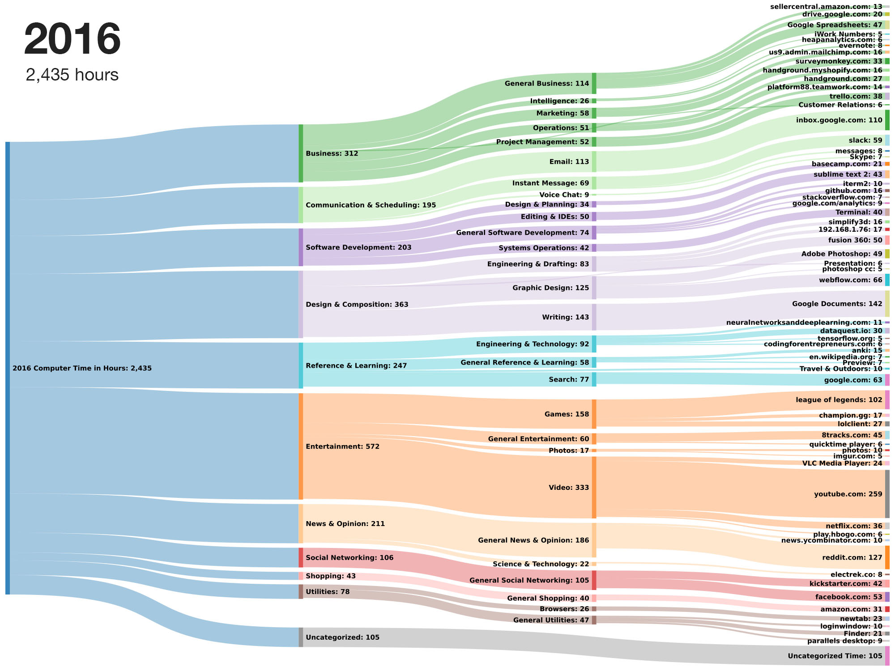

# Snakey Rescuetime Generator

Export your Rescuetime data and display it as a Snakey visualization. 



## Getting Started

1. Get a Rescuetime API key: https://www.rescuetime.com/anapi/manage

2. Download the category level data for each year you want to visualize and save the csv in your working directory. The file should be named in this format: "RescueTime_Report_All_Categories__2014-01-01.csv" Here's the download link: https://www.rescuetime.com/browse/categories/by/rank/for/the/year/of/2014-01-01

3. Clone this repository
``` 
git clone https://github.com/Vitiell0/snakey-rescuetime-generator.git
```

4. Open rescuetime_export.py and change the "year" variable at the top to the year you want to analyze. Change the "api" variable to your API key from step 1.

5. Open an iPython shell and copy/paste all the code in rescuetime_export.py and then paste it into iPython and run it. 

6. A new file called "#### rescuetime activities export.csv" will be saved. There is a column in there called "Snakey" that is in the correct format to copy and paste into http://sankeymatic.com/build/

7. If you want to change the color and arrangement of the categories copy the output in your terminal from running the rescuetime_export.py into SnakeyMATIC. 

Changing the organization of the sub categories will change how the are arranged on SnakeyMATIC. Try to group them by color in the order that you want them to appear. 

An example of the spreadsheet to do this can be found here: https://docs.google.com/spreadsheets/d/15pMdbk9U597BNbXk9uNbRtAvYlNcOK_WH-sezvJt8vY/edit?usp=sharing

8. Copy and paste both the "Main Category Styling" and the "Subcategory Styling" into SnakeyMatic along with the data from the "Snakey" column. 

9. Post your visualization in http://reddit.com/r/dataisbeautiful


